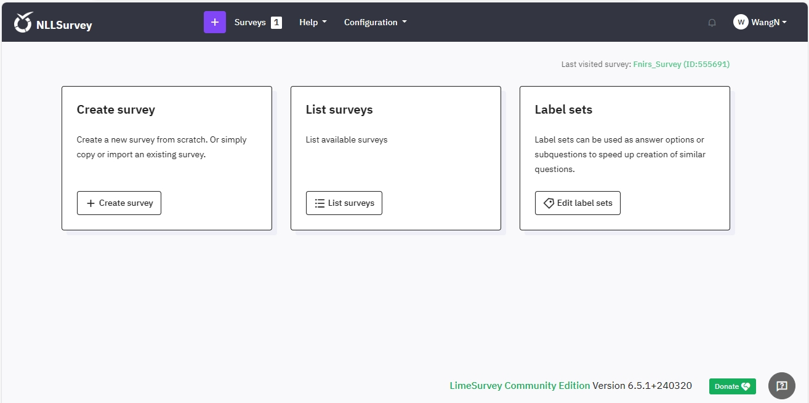
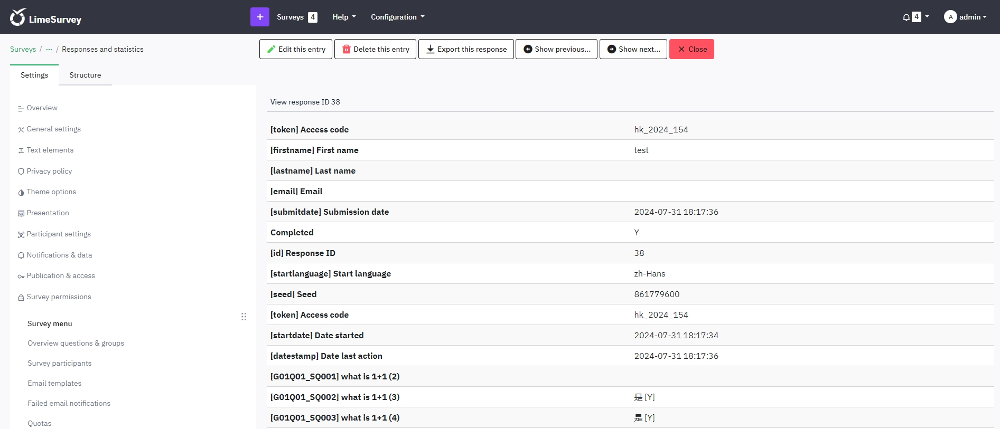

# NLLDS

Quick facts and user documentations for NLLDS (Neurolanglab Data System).

Author: Wu Yidu

Last updated on April 17, 2024 by Yidu

## Overview

The NLLDS was built for the data collection and organization for Prof. Feng Gangyi's research group.

The NLLDS is used for project management, experiment data collection and storage, and questionnaire management. It can be accessed from the public network.

Here are some quick facts for your reference.

- `Web Address`: [http://137.189.158.12/NLLDS/login](http://137.189.158.12/NLLDS/login)
- `Administrators`: Feng Gangyi [(g.feng@cuhk.edu.hk)](mailto:g.feng@cuhk.edu.hk); Wu Yidu [(yiduwu@cuhk.edu.hk)](mailto:yiduwu@cuhk.edu.hk)

## Web Interface

In this section, I will introduce some useful features in our website.

### Login

When you access the web address by your browser (recommand chrome, edge, firefox), you will be directed to the login page. Type your username and password (distributed by administrators), and click `Login` button to login.

### Project

If successful you will see the project page. You will see your projects here (Only if the project is managed by you or you are one of the collaborators), you cannot view other projects which are not relevant to you.

The `Add Project` button is only visible to administrators, which means you are not authorized to create projects. When creating a project, administrators need to fill in the project name, project description (not necessary), and assign managers and collaborators.

Here are descriptions of these fields:

- `Project_ID`: Mark the uniqueness of the project. (automatically generated by the system)
- `Project_Name`: Filled by administrators, supports clicking to jump to the subpage.
- `Survey_ID`: Associated with the survey system automatically, supports clicking to jump to the survey page. Will be mentioned again later.
- `Descriptions`: Filled by administrators.
- `Manage_By`: Specified by administrators.
- `Collaborator`: Specified by administrators.
- `Created_By`: Record who created the project.
- `Created_date`: Project create date.

### Subject

If you click the project name or double-click this project item, you will jump to the subpage which lists all the subject information of this project.

Click `Add Subject` button then you can add subjects for this project. You need to specify the `Subject No.` and make sure it matches the naming format in the prompt message. Please note that `Subject No.` does not allow duplicates.

Here are descriptions of these fields:

- `Subject_No`: Specified by you.
- `Survey`: Associated with the survey system automatically, supports clicking to jump to the survey answer page. Will be mentioned again later.
- `TaskFile`: Lists all the tasks of this project and supports clicking to jump to the file system to view this subject's task data. Each task corresponds to a `Behavior` file. Will be mentioned again later.
- `NeuroFile`: Supports clicking to jump to the file system to view this subject's `Neuroimaging` data.

### Task

Click on the `Task` navigation in the sidebar, then you will come to this page to `Add Task` for each projects. The tasks lists here will be the tasks for all the projects that are relevant to you. And you can only add tasks for these projects, with support for deletion. After added, you'll see the `TaskFile` synchronization updated in the `Subject` page.

Here are descriptions of these fields:

- `Project_ID`: Associated with project.
- `Task_Name`: Filled by you.
- `Task_Descriptions`: Filled by you.
- `Created_By`: Record who created the task.
- `Created_date`: Task create date.

### Survey

Click on the `Survey` navigation in the sidebar, then you will come to the Survey System, which was modified and deployed by the open source project `LimeSurvey`. So you can refer to the official documentation [(https://manual.limesurvey.org/LimeSurvey_Manual)](https://manual.limesurvey.org/LimeSurvey_Manual) for detailed instructions on using this system. You don't need to pay much attention to configuration-related content, as I've already set it up for our usage scenarios, but rather just focus on the questionnaire design and publishing module. Compared to googleform, it supports more comprehensive questionnaire forms and features, and the data can be localized. I will make some special instructions below.

Since the Survey system is independent, you will also need to perform a login operation, with the same account password as you used to log into the NLLDS system.

After successful login, you will come to the main interface, which contains navigation of some main functions, focusing on `Create survey` and `List surveys` pages.

In `List surveys` page, you can view and manage all surveys here. Remember `Survey ID`? We show it on the `Project` page, and it's the ID that allows the project to be associated with the survey. 

So how we can associate them? We need to set up the `Survey alias` same as our project name and then our system will automatically associate with it. If something wrong, the `Survey_ID` shows in the `Project` page will display `Not Found`.

Once everything done, you can find the Survey URL here, also you can click the `Survey_ID` shows in the `Project` page, which use the same link.

We'd better switch the Survey to `closed-access` mode, i.e., Survey participants need to get a pre-assigned access code to access the Survey, and we can assign `SubjectNo` to each participant as their access code.

Fill in the `SubjectNo` assigned to each participant here.

After that, each participant will need to fill in the access code (`SubjectNo`) to access their Survey.

After the survey participant fills in the correct access code and submits their survey, you can view the survey content of each subject in the `Subject` page of NLLDS, and you can also click it to view the detail page; if the subject has not submit the survey or the access code was assigned incorrectly, it will display `Not Found`.

**Please publish the survey after it is fully designed and tested. Do not stop the survey easily after it has published, otherwise all survey data will be archived in the history table and feedback cannot be viewed in real time.**

### FTPServer

The `FTPServer` navigation in the sidebar is only visible to administrators. When click it you will jump to the root path of file system, which means you can view and manage all project files in our system. If you are not an administrator, you do not have this permission. You can only access each subject directory individually in the `Subject` page.

In `Subject` page, clicking the link under `TaskFile` field will jump to the `Behavior` directory of this subject, where you can upload Behavior data here. And click the `view` button under NeuroFile will jump to the `Neuroimaging` directory of this subject, where you can upload Neuroimaging file here.

Here are some features of our file system:

- `Toolbar`: Including some main features like `New folder`, `New file`, `Upload files`, `Download`, `Delete`, `Preview`, etc. 
- `Columns`: Shows some important information about the file and supports sorting.
- `Context menu`: Some of these are similar to the toolbar functionality, with additional support for the `Rename`, `Copy`, `Cut`, `Edit`, `Archive`, etc.
- `Info`: show some file overview information.

Please know that we support drag and drop uploading of files, and please do not close the current page while uploading files until the upload is successful.

Please be careful when making any deletion operations. We will prompt you with a second confirmation.

## Important Notice

- The process of uploading files may be slow due to our server has I/O and network bandwidth limitations, please be patient. It is not recommended to open multiple windows for uploading as it may occupy other people's network bandwidth.
- File uploads and downloads may need to comply with cross-boundary data flow agreements. Please do not upload any sensitive information.
- This system is for internal use only, please do not disclose any website information or personal accounts to non-affiliated parties.
- Any errors or problems found please contact the administrator [(yiduwu@cuhk.edu.hk)](mailto:yiduwu@cuhk.edu.hk) for assistance.

## Useful Resources

- NLLDS source code: [https://github.com/witten-wu/NLLDS](https://github.com/witten-wu/NLLDS)
- LimeSurvey document: [https://manual.limesurvey.org/LimeSurvey_Manual](https://manual.limesurvey.org/LimeSurvey_Manual)