# Qualtrics Manual
Author: Yidu Wu

Last updated on Jul 8, 2025 by Yidu

## CUHK Login
Visit <https://cuhk.qualtrics.com> and login using **@cuhk.edu.hk** or **@link.cuhk.edu.hk** accounts and OnePass Password

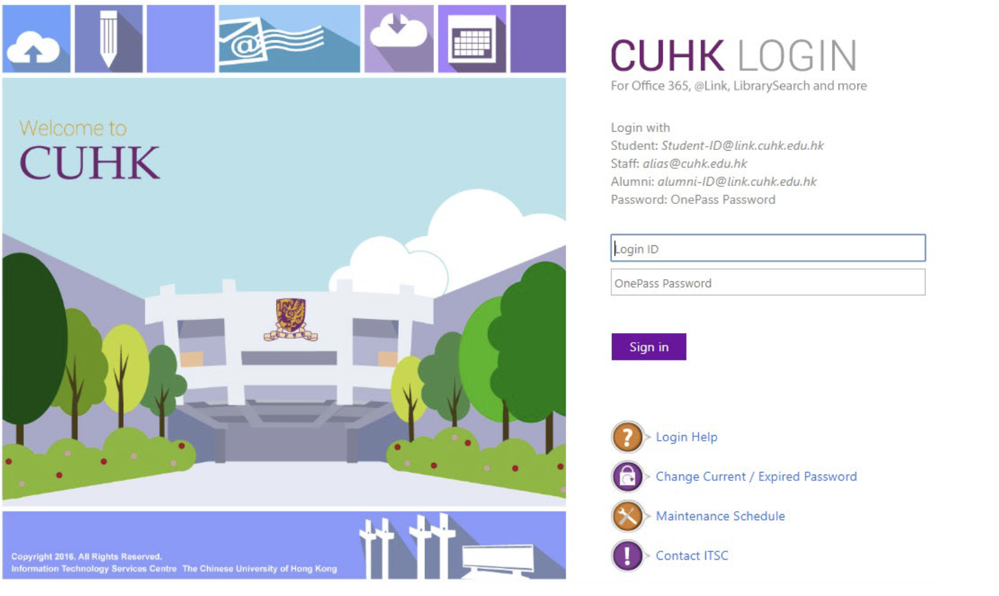

- Qualtrics Online Tutorials: <https://www.qualtrics.com/support>
- Qualtrics Support: <http://www.cuhk.edu.hk/eLearning/qualtrics/Qualtrics-ContactSupport-CUHK.pdf>

After logged in. Qualtrics will display the **Qualtrics homepage**.

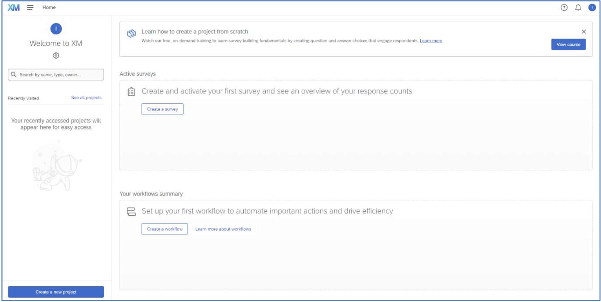

## Create Project
To create a new survey, click the **Create a new project** button at the **Qualtrics homepage**.

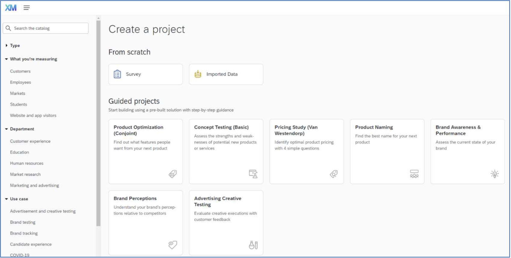

It will direct to the **Create a project** page. You can create a **Survey Project from scratch**, or create a project by using the survey templates provided by Qualtrics. Here, we will focus on creating a **Survey Project from scratch**.

### Create a Survey Project from Scratch
It allows you to create a survey from scratch and add questions to the survey one by one.

1. Select **Survey** at the **Create a project** page.
2. Click the **Get started** button.
3. Enter a **Name** for the survey project.
4. Click the **Create project** button.
5. It will direct to the **Edit Survey** page, and you can add questions to the survey right away.

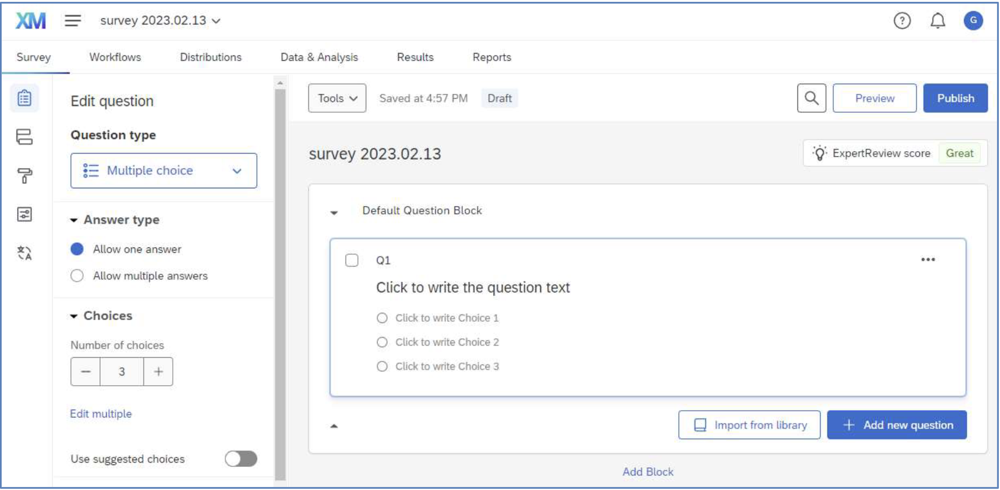

## Prepare Survey

To work on a survey, click the **Menu** button and select **Projects**.

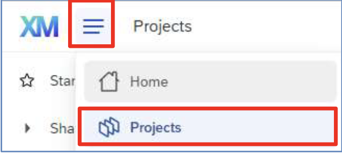

It will direct to the **Projects** page. You can click on the **survey name**, or click the “…” button and select **Edit survey** at the **Projects** page.

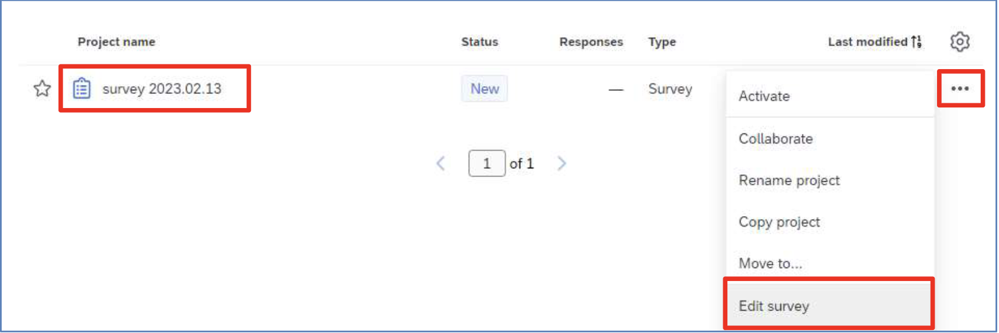

### Add / Edit Question
1. Click the **Add new question** button.
2. A dropdown will display. You can select a question type from the dropdown. A question of the selected question type will be added to the survey.

3. If it is not the question type you need, you can change it by clicking the **Question type** dropdown at the **Edit question** pane at the left hand side.

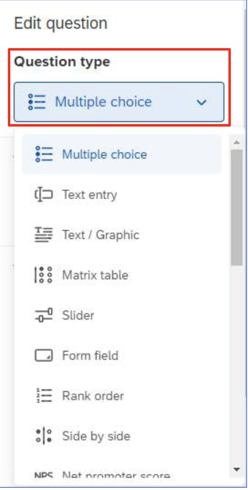

4. Click on the area **Click to write the question text** to enable the text editor and type the question text there.

5. If you want to format the question text, you can click on the **Rich Content Editor…** button.

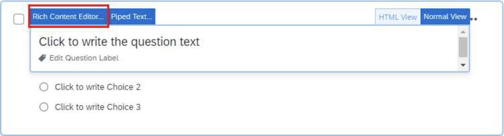

6. Format the text as you prefer. When you finished, click anywhere outside the text editor to close the editor.

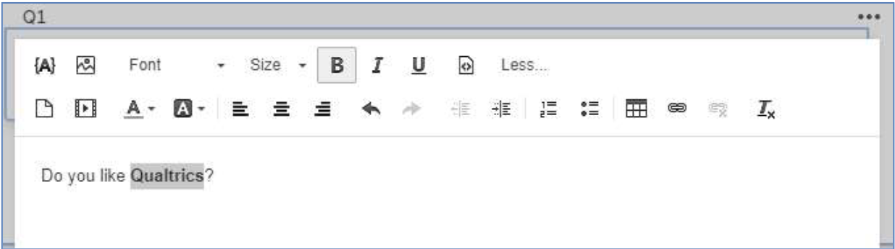

7. If the question is a multiple choice, it will have 3 number of choices (answer options) by default. You can enable **Use suggested choices** at **Edit question** pane. Qualtrics would suggest a list of choices to your question. If you find the choices are not appropriate, you may change them by clicking the dropdown and select an appropriate type.

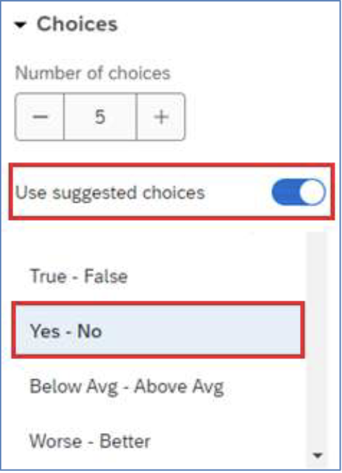

8. If you want to change the number of choices, you can click the “-” or “+” button to add or remove choices, or select **Remove Choice** to delete particular choice.

9. To set the question as mandatory, enable **Add requirements** at **Edit question** pane and check the **Force response** checkbox.

10. Some question types may have more options on validation checking. You may enable **Add validation** at **Edit question** pane and select the appropriate criteria (e.g. you may require the answer must be a number and must be within a range from 1 to 10). **Note**: The options available in Add validation depend on the Question type you select.

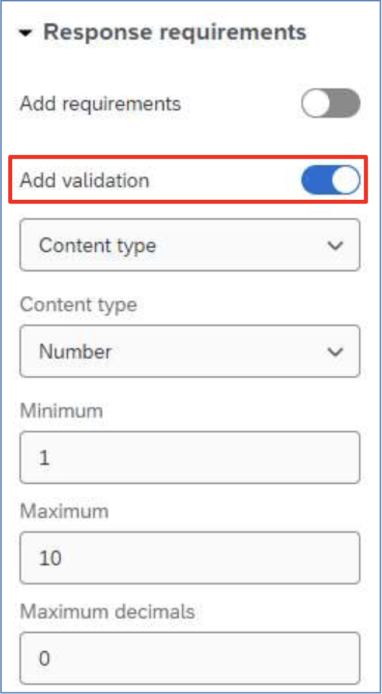

### Delete Question
1. Hover the mouse on the question, click the **red minus** (Remove Question) button. 

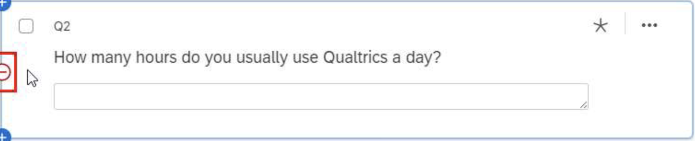

2. You can also click the “…” button and select **Delete** to delete the question.

3. The question will be moved to the **Trash** at the bottom of the page.

4. Select the question. Click the **Permanently delete** button at **Edit question** pane to remove the question from the trash block or click the **Restore** button if you want to get back the question.

5. If you do not need the questions anymore, you can click the **Empty trash** button to remove all the questions from **Trash**.

### Copy Question from Current Survey
1. Click the “…” button and select **Copy**.

2. The question is copied and is placed below the original question.

### Import Question from Another Survey / Library
1. Click the **Import from library** button at the bottom of the question block.

2. The **Question Library** dialog will appear on the right menu. Select **Copy from Existing Survey**.

3. Select a survey.

4. Select the survey question(s) and click the **Import question** button.

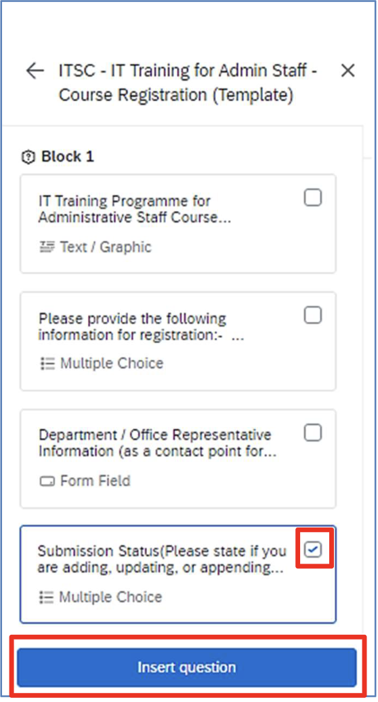

5. A copy of the selected question will be added to the survey as the last question.

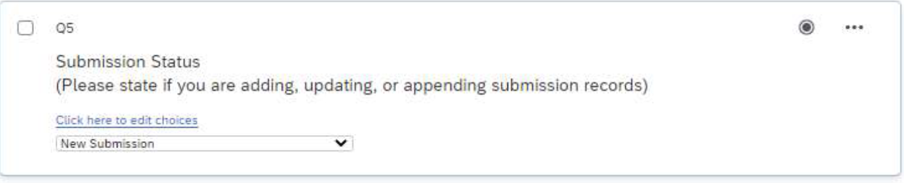

### Move Question
1. Click the “…” button and select **Move question**.

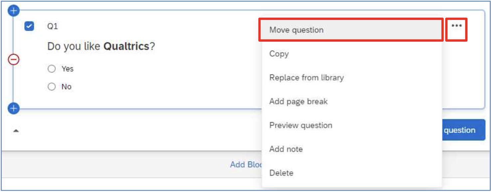

2. The **Move question to** dialog will appear. Click the **Position** dropdown to select the destination of the question. If you select **Top of block** or **Bottom of block**, no further criteria is required.

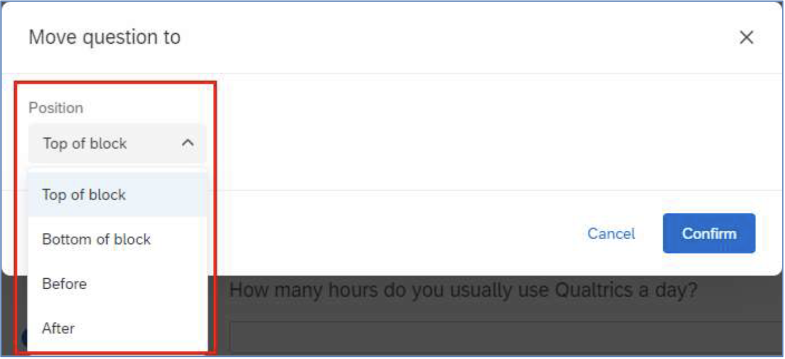

3. If you select **Before** or **After**, you are required to select the moving question should be place before or after which **Question**.

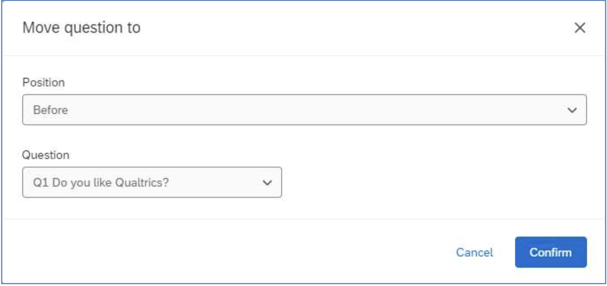

4. Click the **Confirm** button.
5. Q3 is now placed before Q1.

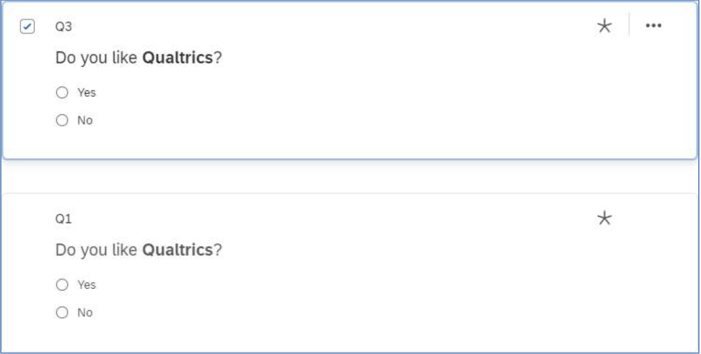

6. You can also hover the mouse on the question, **drag and drop** the question to the new position.

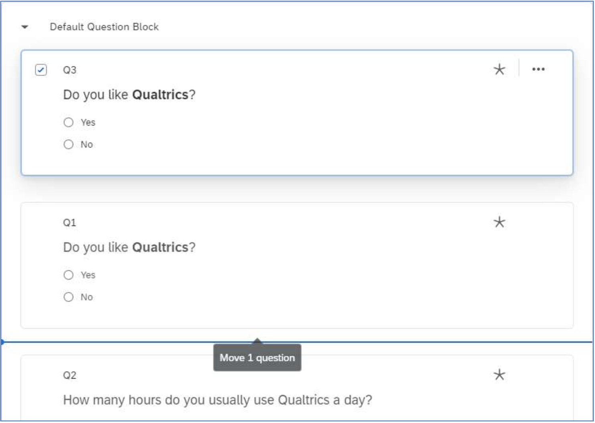

### Add Page Break
1. Click the “…” button and select **Add page break**.

2. A page break will be added after the question.

3. You can also hover the mouse on the space between two questions, the **Add page break** link will appear. Click on the link and a page break will be added between the questions.

### Add Skip Logic
1. Select the question, scroll to the bottom of **Edit question** pane and click the **Skip logic** link.

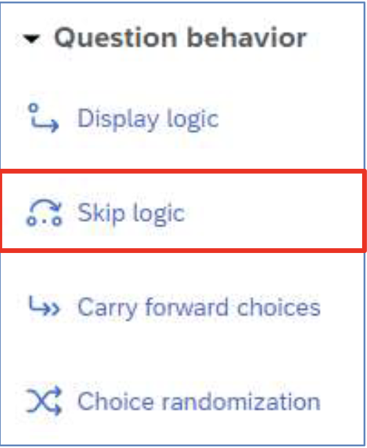

2. The **Skip logic** dialog will appear. Apply the rule by selecting the required criteria.

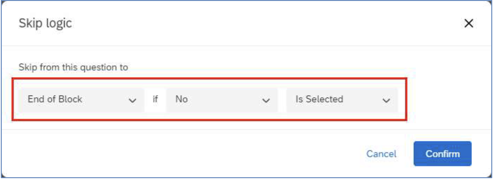

3. Click the **Confirm** button.
4. The details of the skip logic will be displayed.

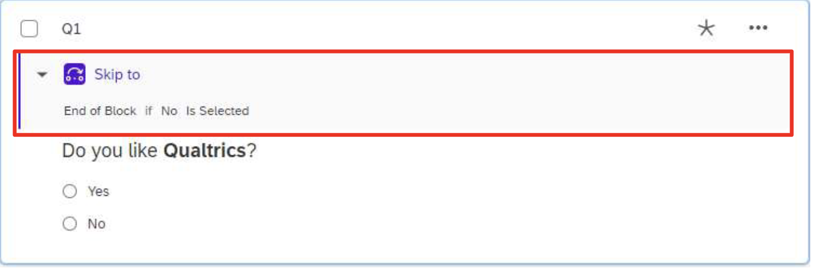

### Add Display Logic
1. Select the question, scroll to the bottom of **Edit question** pane and click the **Display logic** link.

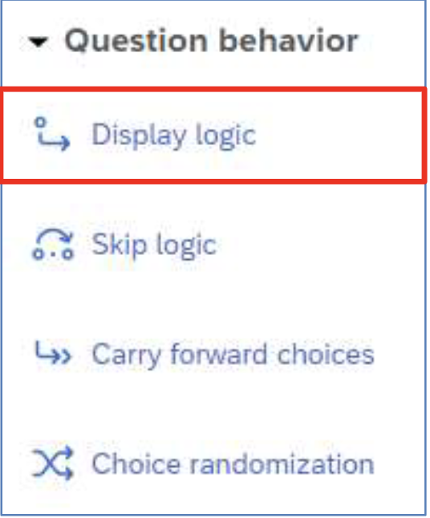

2. The **Display Logic** dialog will appear. Apply the rule by selecting the required criteria.

3. Click the **Save** button.
4. The details of the display logic will be displayed.

### Auto-Number Questions
1. Click the **Tools** dropdown and select **Auto-number questions**.

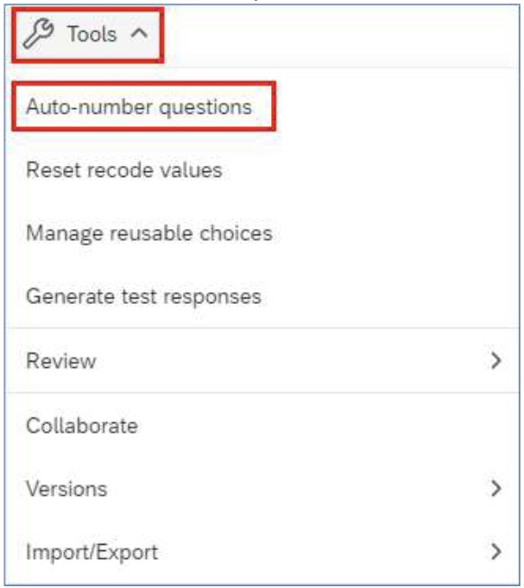

2. The **Auto-Number Questions** dialog will appear. Select the number format you prefer for your survey (e.g. **Sequential Numbering**).

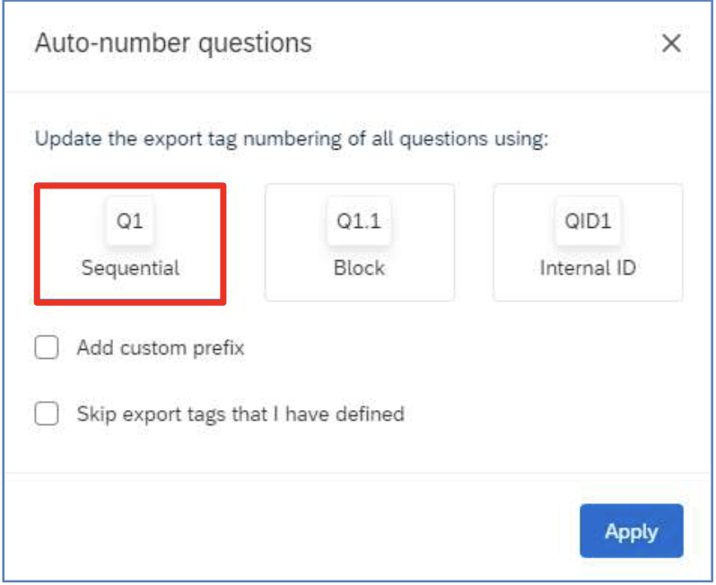

3. The screen will refresh, and the question numbers will be re-ordered.

### Show Progress Bar and Change Next / Back Button Text
1. Click the **Look & feel** button at the left side of the **Survey** page.

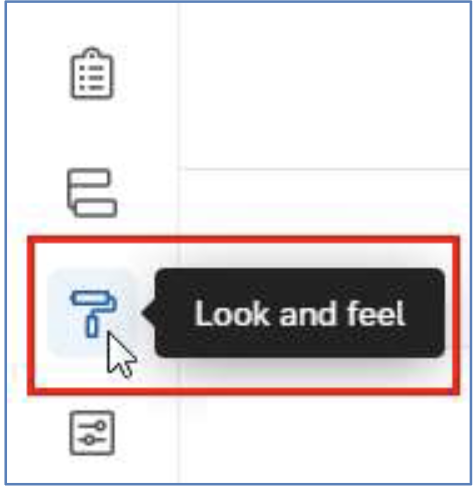

2. The **Look and feel** page will display. Select **General**, click the **Progress Bar** dropdown and select the format of progress bar.

3. Click the **Next Button Text** dropdown. Select **My Library > New Message…**

4. The **Create a New Message** dialog will appear. Fill in the **Description** and the **body** of the text message.

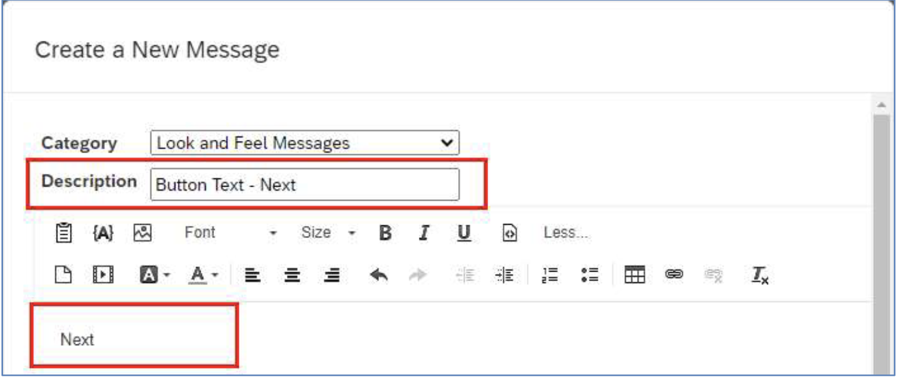

5. Click the **Save** button to close the dialog.
6. It is the same for **Previous Button Text**.
7. Click the **Apply** button.
8. Click the **Builder** button to go back to the **Survey** page.

### Preview Survey
1. Click the **Preview** button.
2. A new web tab window will appear, showing the preview of the survey. The left side displays the view for a computer, and the right side displays the view for a smart device.

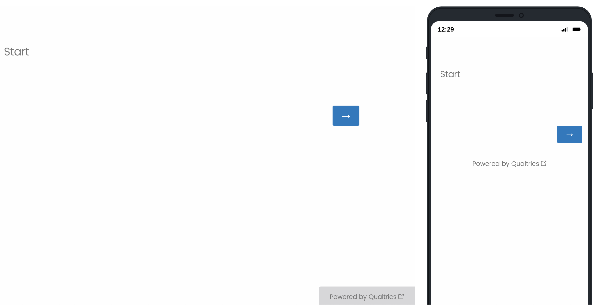

3. Click the **Tools** dropdown and select **Scan QR code**.

4. The **QR Code** dialog will appear. Scan the QR code with your mobile device to display the survey preview on the device. Click the **Close** button to close the dialog.

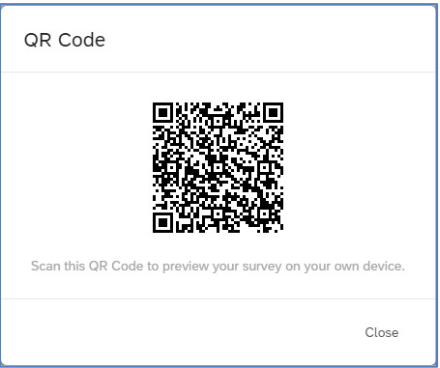

### Collaborate Survey
**Important Note**: If you want to share a survey with a colleague, whom does not have a Qualtrics account, you must ask him/her to activate his/her account first before you do the sharing. Otherwise you and your colleague would come across some unexpected problems.

1. At the **Survey** page, click the **Tools** dropdown and select **Collaborate**.

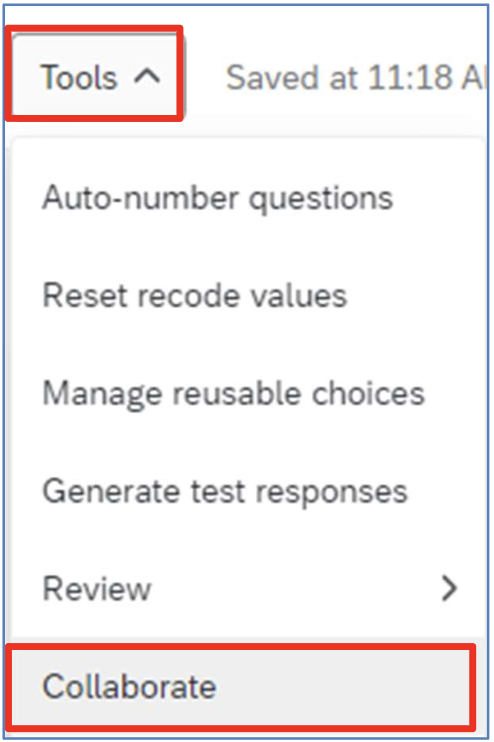

2. The **Collaborate on Project** dialog will appear. Enter the user’s username in the textbox.

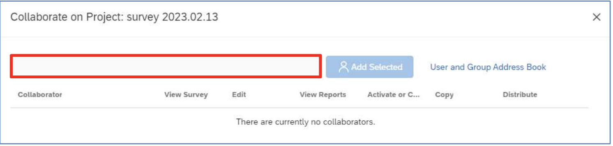

3. Select the **username** from the search result. You must share your survey to **a valid Qualtrics user** (i.e. you can find the name from the search result and the username must have a **suffix #cuhk**).

4. Click the **Add Selected** button.

5. The **Collaborate with** dialog will appear. Click the **Invite** button. It will send an email to notify the user that you want to collaborate a survey with him/her.

6. The selected user will be listed in the table below. Check the checkboxes to share different rights to the user.

7. Click the **Save** button.

## Distribute Survey
A survey must be active before you can collect data from respondents. An active survey would have a survey link, you can send the survey link to the respondents through email. You can also use other social media to distribute your survey to the respondents.

### Set Survey Availability
1. Click the **Survey options** button at the **Survey** page.

2. The **Options** page will display. Select **Responses** from the **Options** pane.

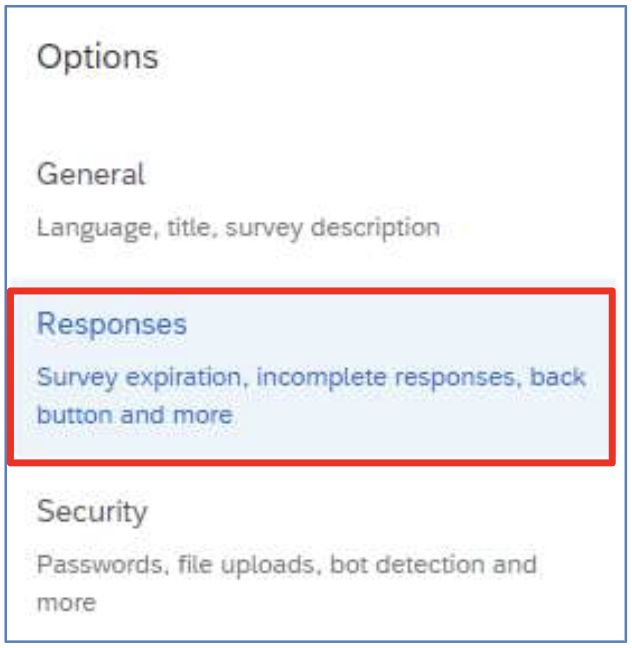

3. Check the **Set specific start and expiration date** checkbox at **Survey availability**.

4. Click the **Edit survey availability** button.
5. The **Edit survey availability** dialog will appear. Update the **Start date, Start time, Expiration date** and **Expiration time** as you need.

6. Click the **Save changes** button.
7. Click the **Builder** button to go back to the **Survey** page.

### Activate Survey
1. At **Survey** page, click the **Publish** button.
2. The **Publish Survey** dialog will appear. Click the **Publish** button.

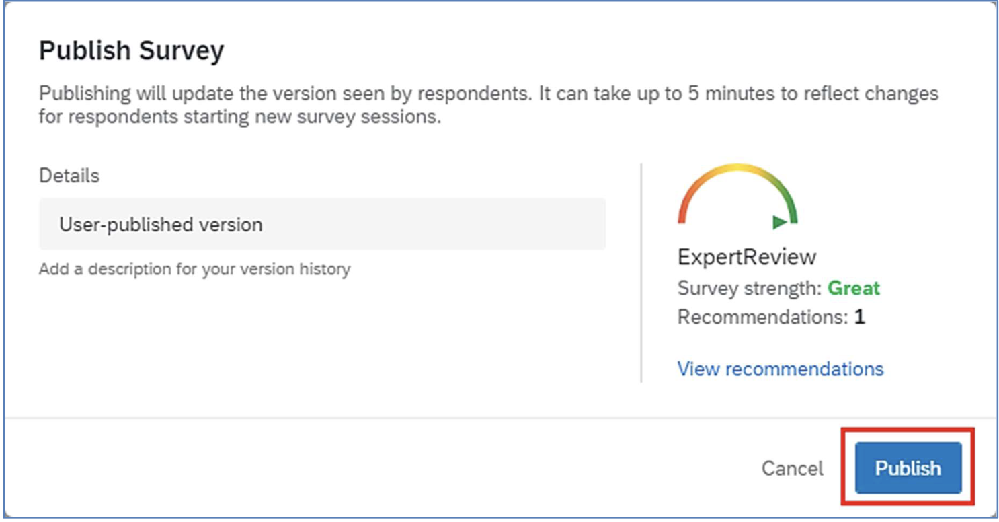

3. The **Survey Activated** dialog will appear. The survey link is displayed in the dialog. You may copy the link and pass it to your target respondents. Click the **Okay** button.

4. Once the survey is activated, you can always go to the **Distributions** page to retrieve the survey link. Click the **Distributions** tab.

5. It will direct to the **Distributions** page. Click **Anonymous link** at the left panel of the page.

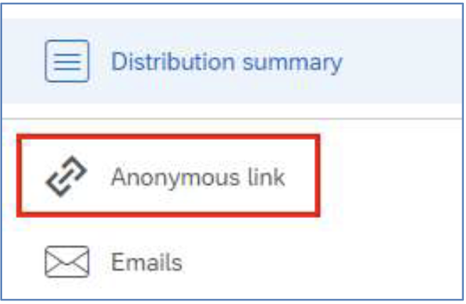

6. The page will display the survey link there.

### Close Survey
1. At **Distributions** page, click the **Pause response collection** button.
2. The **Pause response collection** dialog will appear. Select the option for the unfinished survey sessions. Click the **Pause response collection** button.

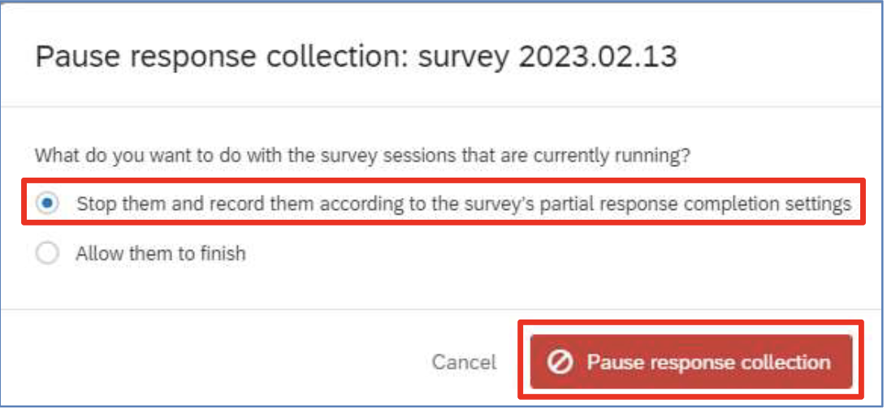

## Data & Analysis and Results
When a survey started collecting responses, you can see the response data right away.

### View Recorded Responses
1. Click the **Data & Analysis** tab

2. The **Data & Analysis** page display a list of recorded (completed) responses by default.

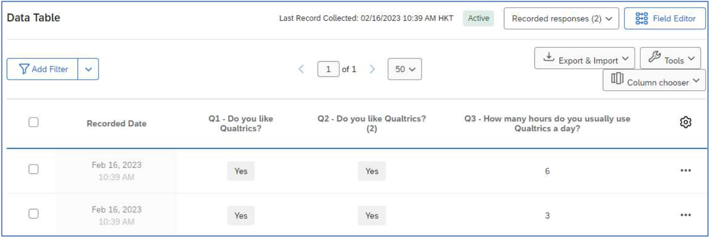

3. Click the “…” button and select **View Response** to view the details of the response.

4. The **Recorded** dialog will appear, showing the details of the response.

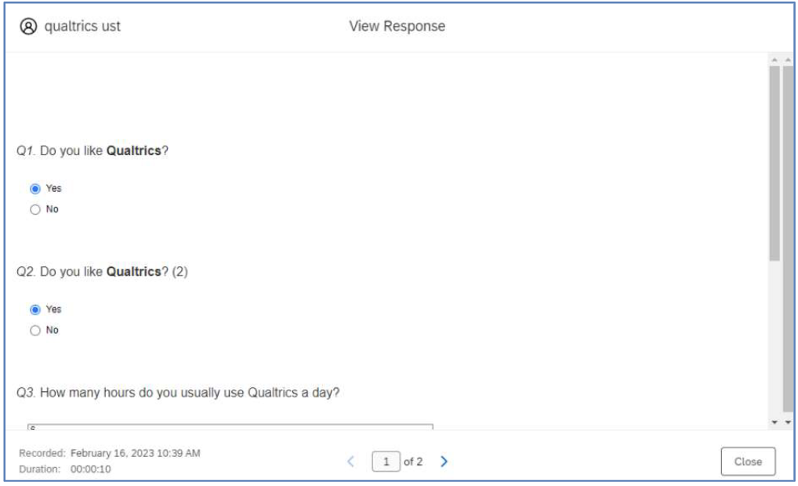

5. Click the **Close** button to close the dialog.

### Delete Recorded Response
1. Check the checkbox next to the response record. Click the **Delete** button to delete a response.

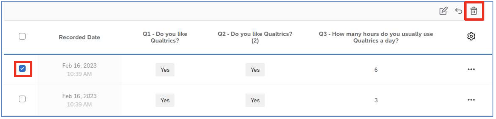

2. The **Delete Responses** dialog will appear. Check the **I am sure I want to delete 1 response** checkbox. Click the **Delete 1 response** button to confirm the action.

### View Responses in Progress
1. At **Data & Analysis** page, click the **Recorded responses** dropdown and select **Responses in progress**.

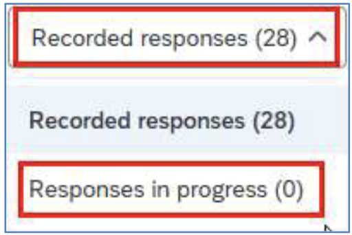

2. The page will display a list of responses in progress (not completed responses).

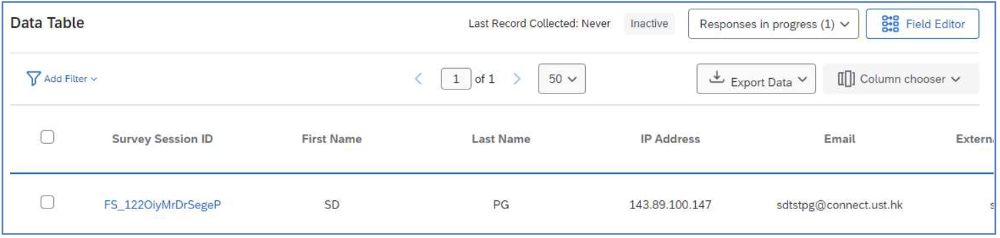

3. Click on a **Survey Session ID** link to view the details of the response.

4. The **Respondent > Partial Response** dialog will appear, showing the details of the response.

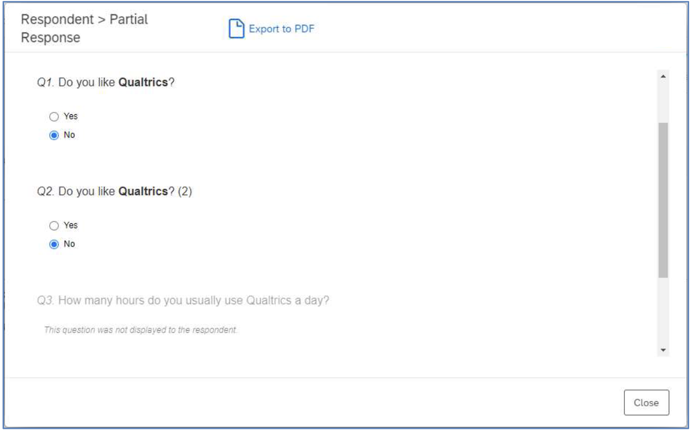

5. Click the **Close** button to close the dialog.

### Delete Response in Progress
1. Check the checkbox next to the response record, click the **Delete** button to delete a response.

2. The **Delete Responses in Progress** dialog will appear. Check the **I am sure I want to delete 1 response** checkbox. Click the **Delete 1 response** button to confirm the action.

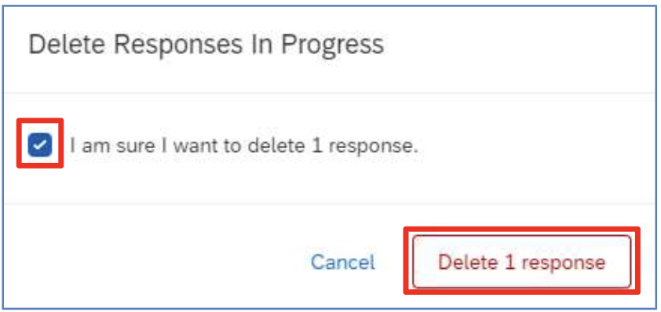

### Download Response Data
1. At the **Recorded Responses** page, click the **Export & Import** dropdown and select **Export Data**….

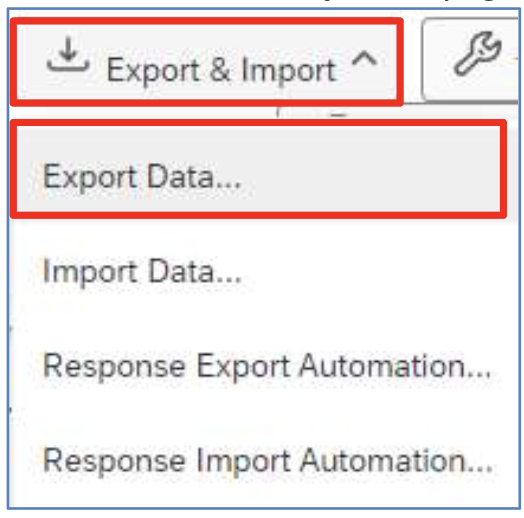

2. The **Download a data table** dialog will appear.

3. Select a **file format** to download the data with the selected format, e.g. Excel.

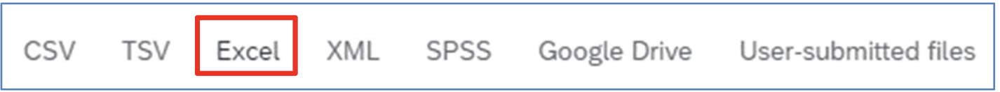

4. Check if **Use choice text** checkbox is checked. Click the **Download** button.

5. In the **Manage Downloads** dialog, click the **Download** link to save the file in a local PC.

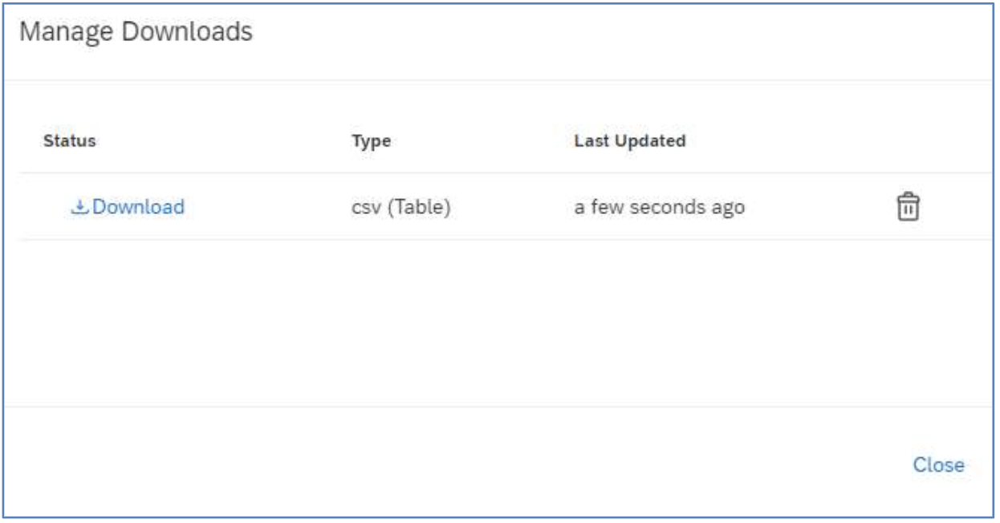

6. Click the **Close** button to close the dialog.

### View Default Report
1. Click the **Results** tab.

2. It will direct to the **Results** page. The default report is displayed, and the results of questions are displayed one by one.

3. You can go to a specific question by selecting the question text. Add a Filter by Question

### Add a Filter by Question 
1. Click the **Add Filter** dropdown and select the question text.

2. The filter rule will be displayed. Select an operation from the **Select Operator** dropdown and select the choice from the **Select Operand** dropdown.

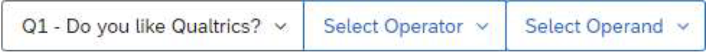

3. The rule would be displayed, and the report will refresh accordingly to show the latest results according to the rule applied.

### Export Report
1. Click the **Share Report** dropdown, and select the report format, including **PDF Document, Word Document, PowerPoint Slides** or **CSV (Comma Separated)** (spreadsheet).

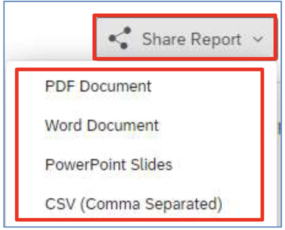

2. The **Export Report** dialog will appear. You can change your report format by clicking on the tabs of each report format and check/uncheck the checkbox to select which question(s) to be exported.

3. Click the **Export Pages** button.
4. The **Download Previous Exports**… dialog will appear. Click the **Download** link to collect the report.

5. Click the **Done** button to close the dialog.

## Reference
- Qualtrics: <https://www.qualtrics.com/support/survey-platform/getting-started/survey-platform-overview/>
- Qualtrics CUHK ITSC: <https://www.itsc.cuhk.edu.hk/all-it/business-applications/qualtrics/>
- Qualtrics HKUST: <https://itsc.hkust.edu.hk/sites/default/files/site-files/qualtrics/Qualtrics_IntroductionToQualtrics_202407.pdf>
- Qualtrics CUHK: <https://cuhk-edt.knowledgeowl.com/docs/qualtrics-overview>