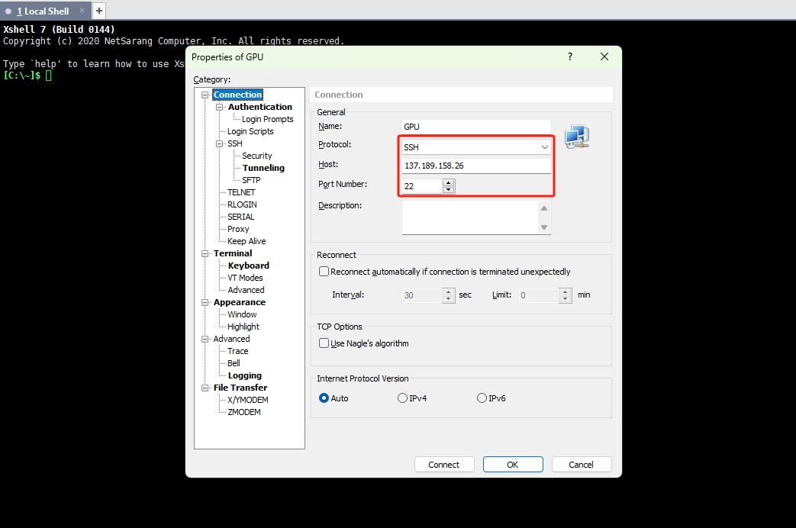
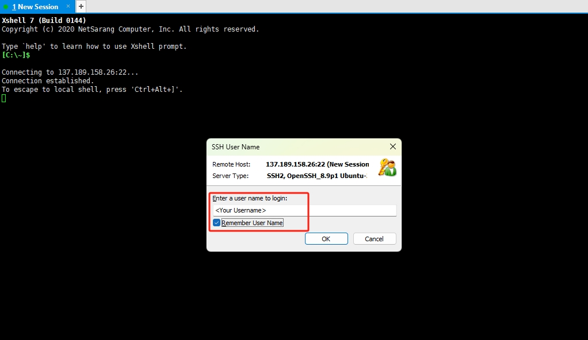
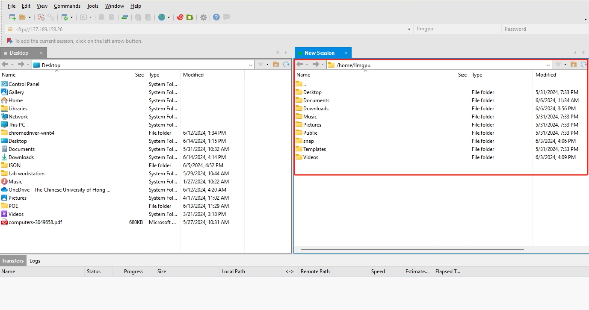
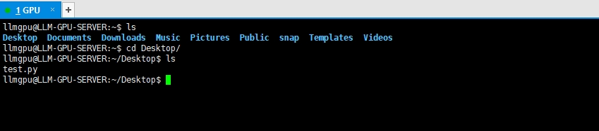
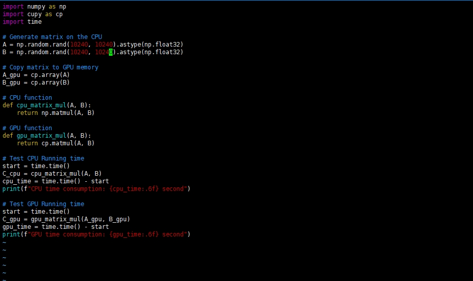
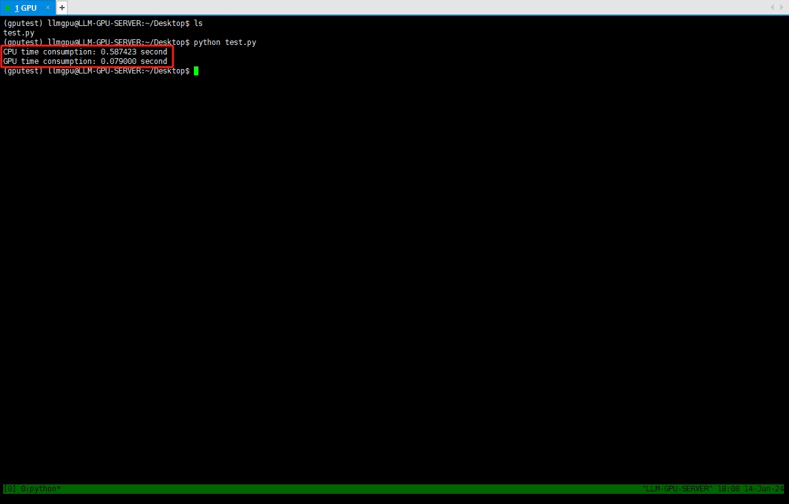
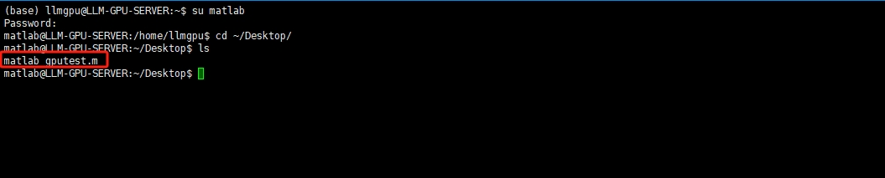
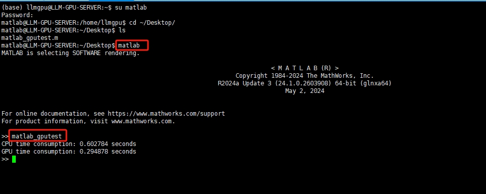

# Computing Resources
Author: Yidu Wu

Last updated on Jul 8, 2025 by Yidu

## Department HPC
Our department provides students and staff with shared high-performance computing resources for large-scale research jobs.

| GPU Server with 8x NVIDIA L40S |                                            |
| ------------------------------ | ------------------------------------------ |
| GPU          | [8x] NVIDIA L40S 48GB                                        |
| CPU          | [2x] Intel Xeon Gold 6426Y, 16C/32T, 2.5 to 4.1 GHz, 37.5 MB |
| RAM          | [8x] 32GB DDR5-4800 ECC RDIMM                                |
| Server Model | Gigabyte G493-SB1                                            |
| Motherboard  | MSB3-G40

Before using the HPC, you should get the support from the cuhk central cluster.

## Lab Workstation Summary
In addition to the department HPC, we also have two workstations for daily lightweight jobs.

| Workstation               | Type     | Interface     | Location |
| ------------------------- | -------- | ------------- | -------- |
| Dell Precision 7960 Tower | GPU Node | SSH           | BMI      |      
| HP Z8                     | CPU Node | SSH & Desktop | KKL 209  |          

### 1. Dell Precision 7960 Tower
| Computing Unit     | Detail                                    | RAM              |
| ------------------ | ----------------------------------------- | ---------------- |
| CPU                | [1x] Intel Xeon w7-3455 4.8GHz 24C/48T    | 502GB            |
| GPU                | [1x] NVIDIA RTX A6000                     | 48GB             | 

| Storage                   | Capacity  | Disk          | Mount          |
| ------------------------- | --------- | ------------- | -------------- |                   
| KXG80ZN84T09 NVMe KIOXIA  | 4TB       | /dev/nvme0n1  | / & /home      |
| PC SN810 NVMe WDC         | 2TB       | /dev/nvme1n1  | /SSData0       |
| ST12000NM002J-2T          | 12TB      | /dev/sda      | /BigData0      |

| Other Configurations   | Remark                                        | 
| ---------------------- | --------------------------------------------- | 
| Operating System       | Ubuntu 22.04 LTS                              |
| Network                | 1Gbps LAN connected to CUHK network           |

| Packages pre-installed  | Version |
| ------------------------| ------- | 
| Python                  | 3.10.12 |
| MATLAB                  | R2024a  |
| CUDA                    | 12.0    |
| cuDNN                   | 8.9.7   |
| Conda                   | 24.1.2  |
| GCC/G++                 | 11.4.0  |
| Cmake                   | 3.22.1  |
| Java                    | 1.8     |
| Git                     | 2.34.1  |
| Vim                     | 8.2     |
| Tmux                    | 3.2a    |
| Docker                  | 27.2.1  |

| IP               | Port  | User Type     | Remark                                         |
| ---------------- | ----- | ------------- | ---------------------------------------------- |  
| 137.189.158.32   | 22    | CUHK User     | Off-campus users should connect CUHK VPN first |
| 8.219.66.9       | 6000  | Non-CUHK User | Forwarded by Aliyun, latency may exist         |        

### 2. HP Z8
| Computing Unit     | Detail                                    | RAM              |
| ------------------ | ----------------------------------------- | ---------------- |
| CPU                | [2x] Intel Xeon 5418Y 3.80GHz 48C/96T     | 256GB            |

| Storage                            | Capacity  | Disk          | Mount          |
| ---------------------------------- | --------- | ------------- | -------------- |                   
| HP Z Turbo Drive Quad Pro TLC SSD  | 2TB       | /dev/nvme0n1  | / & /home      |
| Z Turbo TLC SSD                    | 512GB     | /dev/nvme1n1  | /SSData0       |
| 7200RPM SATA 3.5in Enterprise      | 8TB       | /dev/sda      | /BigData0      |

| Other Configurations   | Remark                                        | 
| ---------------------- | --------------------------------------------- | 
| Operating System       | Ubuntu 22.04 LTS                              |
| Network                | 1Gbps LAN connected to CUHK network           |

| Packages pre-installed  | Version |
| ------------------------| ------- | 
| Conda                   | 24.1.2  |
| GCC/G++                 | 11.4.0  |
| Cmake                   | 3.22.1  |
| Git                     | 2.34.1  |
| Vim                     | 8.2     |
| Tmux                    | 3.2a    |
| Docker                  | 27.2.1  |

| IP               | Port  | User Type        | Remark                        |
| ---------------- | ----- | ---------------- | ----------------------------- |  
| 137.189.85.27    | 22    | All User         | Need 2FA Google Authenticator |


<!-- ```bash
+ ---------------------------------------------------------------------- +
| Workstation: Precision 7960 Tower (0A3A)                               |
+ ====================================================================== +
| Computing Power:                                                       |
| ---------------------------------------------------------------------- |
| Type    | Detail                                    | RAM              |
| ---------------------------------------------------------------------- |
| CPU     | [1x] Intel Xeon w7-3455 2.50 GHz 24C/48T  | 502GB            |
| GPU     | [1x] NVIDIA RTX A6000                     | 48GB             | 
+ ====================================================================== +
| Storage:                  | Capacity  | Disk          | Mount          |
| ---------------------------------------------------------------------- |                   
| KXG80ZN84T09 NVMe KIOXIA  | 4TB       | /dev/nvme0n1  | / & /home      |
| PC SN810 NVMe WDC         | 2TB       | /dev/nvme1n1  | /SSData0       |
| ST12000NM002J-2T          | 12TB      | /dev/sda      | /BigData0      |
+ ====================================================================== +
| Other Configurations:                                                  |
| ---------------------------------------------------------------------- | 
| Network                | 1Gbps LAN connected to CUHK network           |
| Operating System       | Ubuntu 22.04 LTS                              |
+ ---------------------------------------------------------------------- +

+ ---------------------------------------------------------------------- +
| Connectivity Entry:                                                    |
| ---------------------------------------------------------------------- |
| IP               | Port  | User Type      | Remark                     |
| ---------------------------------------------------------------------- |  
| 137.189.158.26   | 22    | CUHK User      | Off-campus user need VPN   |
| 8.219.66.9       | 6000  | Non-CUHK User  | Aliyun forwarding          |
+ ---------------------------------------------------------------------- +

+ ---------------------------------+
| Packages pre-installed:          |
| -------------------------------- |  
| Python 3.10.12                   |
| CUDA 12.0                        |
| cuDNN 8.9.7                      |
| Conda 24.1.2                     |
| GCC/G++ 11.4.0                   |
| Cmake 3.22.1                     |
| Java 1.8                         |
| Git 2.34.1                       |
| Vim 8.2                          |
| Tmux 3.2a                        |
+ ---------------------------------+
``` -->

### How to use lab workstation
Please note that the following content only gives minimum information to run a program on our workstations. For guidance on using departmental high-performance computing resources, we will not explain in detail here, because HPC uses the slurm workload manager and you should get the support from the cuhk central cluster.

### Get Your Account
Before you use the workstation, you should apply an account from our administrators. Please send an email to Yidu Wu ([yiduwu@cuhk.edu.hk](mailto:yiduwu@cuhk.edu.hk)) with your **name**, **position**, and **expected study years (for students)**.

### If you are new to Linux
Unfortunately, our workstation is running Linux operating system. If you have never used Linux before, it may be pretty uncomfortable for you to use a new operating system by command line but not GUI. We understand your feeling, but please try to get familiar with Linux commands on a virtual machine before moving on.

The following document assumes you have experience with Linux.

### For Windows Users
To access a Linux server on Windows, you need to install software through **SSH** and **SFTP**. You can try out the following software.

- SSH Client (For Command Line): [MobaXterm](https://mobaxterm.mobatek.net/), [XShell (Recommand)](https://www.netsarang.com/en/xshell/)
- SFTP Client (For File Upload): [MobaXterm](https://mobaxterm.mobatek.net/), [Xftp (Recommand)](https://www.netsarang.com/en/xftp/), [FileZilla](https://filezilla-project.org/)

Here is the URL to download `Xshell` and `Xftp`: https://www.netsarang.com/en/free-for-home-school/ . Please note that this is free, no purchase required.

#### Connect Example (XShell)

After installation we run Xshell, the first thing we need to do is to create a new session to connect to our workstation. Here is the configuration:

- `Protocal`: SSH
- `Host`: IP Address (Reference Workstation Summary)
- `Port`: Port (Reference Workstation Summary) 



After that, click `Connect` button and enter your username with password.




After connected, you can start executing your command now! Please note that each user will have their own home dir, as shown in the picture, `/home/<your_username>` is your home path. You can run your program and upload your files here. 


#### Connect Example (XFtp)

Similar to above, we run XFtp and make the configuration.

- `Host`: IP Address (Reference Workstation Summary)
- `Protocal`: SFTP
- `Port`: Port (Reference Workstation Summary) 
- `Method`: Password

Enter your username with password and click connect button.


After connected, The left panel is your local file system and the right is the remote. You can now upload and download files as you like. 



Please make sure that you only upload files to these three paths, which you have the full access:

- `/home/<your_username>`: Your home dir (50GB quota, Ask me for more space If quota exceeded)
- `/BigData0`: Extra Disk (Reference Workstation Summary) (please store your large files here)
- `/SSData0`: Extra Disk (Reference Workstation Summary) (use it when /BigData0 disk full)

### For Linux/MaxOS Users

The workstation can log through `SSH`. On Linux or macOS terminal, input the following command to login.
```bash
$ ssh <username>@<ip> -p <port>
```
After a successful connection, the server will prompt you to enter a password. Please enter the password which you got from administrators at this time. There will be no response on the interface when you enter the password, but the password has already been entered.

### Change your password at your first login
An initial password was sent to each user for their first-time-login. For security reason, please change your password with:
```bash
$ passwd
```

### Package Installation
Please note that for security reasons, all users do not have `sudo` permissions by default. It means that you cannot install the required packages by raising to `root` privileges with the `sudo` command! Nevertheless, you can still install the packages you need by the way of compiling the source code, although this will take some effort and requires some expertise in linux. Alternatively, you can contact the administrator to install the packages for you.

### Run your Programme on our Compute Nodes
Since we only have 1 GPU right now, we are holding off on using e.g. SLURM resource management software to manage our workstation. Instead of it, at this stage we consider a negotiated allocation to use our compute nodes. An easy way to do this is to book it directly in the DingTalk calendar! Before using the workstation you should organize your schedule ahead of time and add it to our DingTalk calendar, making sure not to cross over with other people's schedules. Please use computing nodes strictly according to the calendar schedule. If there are indeed urgent tasks that need to be prioritized, please negotiate with the user who owns the current schedule.

#### Check the resources
Before running the program, check the GPU to ensure there are sufficient computing resources, input the following command.
```bash
$ nvidia-smi
```
And it will output:
```bash
+---------------------------------------------------------------------------------------+
| NVIDIA-SMI 535.171.04             Driver Version: 535.171.04   CUDA Version: 12.2     |
|-----------------------------------------+----------------------+----------------------+
| GPU  Name                 Persistence-M | Bus-Id        Disp.A | Volatile Uncorr. ECC |
| Fan  Temp   Perf          Pwr:Usage/Cap |         Memory-Usage | GPU-Util  Compute M. |
|                                         |                      |               MIG M. |
|=========================================+======================+======================|
|   0  NVIDIA RTX A6000               Off | 00000000:AC:00.0 Off |                  Off |
| 30%   32C    P8              12W / 300W |    308MiB / 49140MiB |      0%      Default |
|                                         |                      |                  N/A |
+-----------------------------------------+----------------------+----------------------+
                                                                                         
+---------------------------------------------------------------------------------------+
| Processes:                                                                            |
|  GPU   GI   CI        PID   Type   Process name                            GPU Memory |
|        ID   ID                                                             Usage      |
|=======================================================================================|
|    0   N/A  N/A      1995      G   /usr/lib/xorg/Xorg                          180MiB |
|    0   N/A  N/A      2143      G   /usr/bin/gnome-shell                         47MiB |
+---------------------------------------------------------------------------------------+
```
You can see the relevant parameters of the GPU, such as model, CUDA version, memory usage, etc. In this case, The `308MiB / 49140MiB` stands for 'used/total memory', make sure there is enough memory for you to use! You can also see all processes that are taking up memory, and if you make sure that a process doesn't need to run anymore, you can kill it to free up memory. But be careful not to kill programs that other users may be running!

#### Conda
First thing first, whenever you create a new python project, the most important step is setting up the python interpreter. Using the python interpreter of your virtual enviornment is recommended, which can separate the develop enviroments for each of your project.

`Conda` is officially recommended by PyTorch and TensorFlow. Here’s some `conda` command:

```bash
# create conda env with python (you can specify python version)
conda create --name <new-env-name> python=3.8
# check envs
conda env list
# activate env
conda activate <env-name>
# deactivate env
conda deactivate
# install package like pandas
conda install pandas
```

#### Tumx
If you only use ssh to connect to the server to run the program, the program will be shut down as soon as ssh breaks (Even if you don't end it manually, ssh will often break unexpectedly due to network problems). The solution is to use tmux to open a session and run it in the background, even if ssh breaks, tmux server will still keep that session for you, so the program will always run in the background.

Start a background terminal session using `tmux`.Simply run `tmux`, you can get a new session. After run the job, press `Ctrl+B D` shortcut to detach the session. When you return, use `tmux ls` to see the session ID, then use `tmux a -t <ID>` to attach the session and continue the job.

#### MATLAB

All of the above assumes you are using the python; if you are a MATLAB user, please read the following carefully.

We have already pre-installed the MATLAB (R2024a) in our workstation. Unfortunately, we are unable to share MATLAB licences within the workstation due to MATLAB's strict licensing requirements. And it's also not possible to sign in with multiple user accounts on the same server instance, whether it's a real or virtual server. This means that only one user is allowed to use MATLAB in our workstation at any given time, and if other users need to use it they need to queue up, so I recommend that you schedule a MATLAB appointment in our DingTalk calendar just like GPU before.

I recommend using the MATLAB resources in our workstation only when you need to use the GPU to assist in computing MATLAB program, because in this way the occupancy time of MATLAB is consistent with the occupancy time of the GPU. For other tasks, you can do it on your own computer with CPU.

Nevertheless, you can still use it without restriction by installing a separate MATLAB program in your own home dir. This assumes that you have a MATLAB licence and you can activate it with your own licence. 

**Instructions for using our pre-installed MATLAB:**

Before using it you should get the username/password of our MATLAB user from the administrator, please note that this is a separate LINUX user which only used to run MATLAB. Please make sure to plan your time well and don’t take up too much time or conflict with others.

Please note that if you need to install any third-party tools, please contact the administrator!

Please also note that the pre-installed MATLAB in our workstation is tied to our administrator's licence. If you encounter MATLAB updates or verifications from time to time, please contact administrator for assistance.

We will give a running example of MATLAB below.

#### Running example (Python)

Here I will show you an example to run python programme.

- Suppose we want to execute the following Python code, which is the multiplication of two matrix of 10240 x 10240 dimensions:

```bash
import numpy as np
import cupy as cp
import time

# Generate matrix on the CPU
A = np.random.rand(10240, 10240).astype(np.float32)
B = np.random.rand(10240, 10240).astype(np.float32)

# Copy matrix to GPU memory
A_gpu = cp.array(A)
B_gpu = cp.array(B)

# CPU function 
def cpu_matrix_mul(A, B):
    return np.matmul(A, B)

# GPU function
def gpu_matrix_mul(A, B):
    return cp.matmul(A, B)

# Test CPU Running time
start = time.time()
C_cpu = cpu_matrix_mul(A, B)
cpu_time = time.time() - start
print(f"CPU time consumption: {cpu_time:.6f} second")

# Test GPU Running time
start = time.time()
C_gpu = gpu_matrix_mul(A_gpu, B_gpu)
gpu_time = time.time() - start
print(f"GPU time consumption: {gpu_time:.6f} second")
```

- The first thing we need to do is to upload this python file to our GPU workstation, We've already covered how to upload files with XFtp earlier on.

- Supposed I have already uploaded the python file to my home path. Now we can check it.



We can see the test.py under my home dir. Now use `vi test.py` to view the file content.



- If there is no problem, we can prepare to run the code. Excute the following command to create a virtual enviornment for python.

```bash
conda create --name gputest python=3.9
```

Learn to use conda to separate the develop enviroments for each of your project is very important.

After that, excute command `tmux` and we will get a new window like this:


Tumx can make the program always run in the background even if you exit the ssh. 

Now we need to activate the virtual python environment created before, like this:


We can find our python environment has changed from base to `gputest`.

- install the packages required.

```bash
conda install numpy
conda install -c conda-forge cupy
```

6. Then we run the GPU python code, we can find that the GPU is much faster than the CPU.



#### Running example (MATLAB)

Here I will show you an example to run MATLAB programme.

- Suppose we want to execute the following matrix multiplication MATLAB code:

```bash
% Generate matrix on the CPU
A = rand(10240, 10240, 'single');
B = rand(10240, 10240, 'single');

% Copy matrix to GPU memory
A_gpu = gpuArray(A);
B_gpu = gpuArray(B);

% CPU function
function C = cpu_matrix_mul(A, B)
    C = A * B;
end

% GPU function
function C = gpu_matrix_mul(A, B)
    C = gather(A * B);
end

% Test CPU Running time
tic;
C_cpu = cpu_matrix_mul(A, B);
cpu_time = toc;
fprintf("CPU time consumption: %.6f seconds\n", cpu_time);

% Test GPU Running time
tic;
C_gpu = gpu_matrix_mul(A_gpu, B_gpu);
gpu_time = toc;
fprintf("GPU time consumption: %.6f seconds\n", gpu_time);
```

- Login to our workstation as a MATLAB user. You can switch to it by command `su matlab`. Then type the password got from our administrator.


- Then upload the MATLAB file to this home dir. In this case, I have uploaded it under Desktop folder.



- Then run the `matlab` command directly to start matlab, which we set to start from the command line by default. And the we can execute our GPU test programme like this:



Then we can see the resuls.

**Now you should know how to run your programme in our workstation.**

## Quick Reference
### Contact
The workstation and the storage server are managed by Yidu Wu ([yiduwu@cuhk.edu.hk](mailto:yiduwu@cuhk.edu.hk)).

### Useful Links
- CUHK Central Cluster: <https://www.cuhk.edu.hk/itsc/hpc/index.html>
- CUHK VPN: <https://www.itsc.cuhk.edu.hk/all-it/wifi-and-network/cuhk-vpn/>
- Conda User Guide: <https://docs.conda.io/projects/conda/en/latest/user-guide/index.html>
- Tmux User Guide: <https://hamvocke.com/blog/a-quick-and-easy-guide-to-tmux/>
- Linux Command Guide: <http://www.linuxcommand.org/tlcl.php/tlcl.php>
- MATLAB Installation Guide: <https://ww2.mathworks.cn/matlabcentral/answers/98886-how-do-i-install-matlab-and-its-toolboxes>
- MATLAB GPU Guide: <https://ww2.mathworks.cn/help/parallel-computing/gpu-computing-requirements.html>
